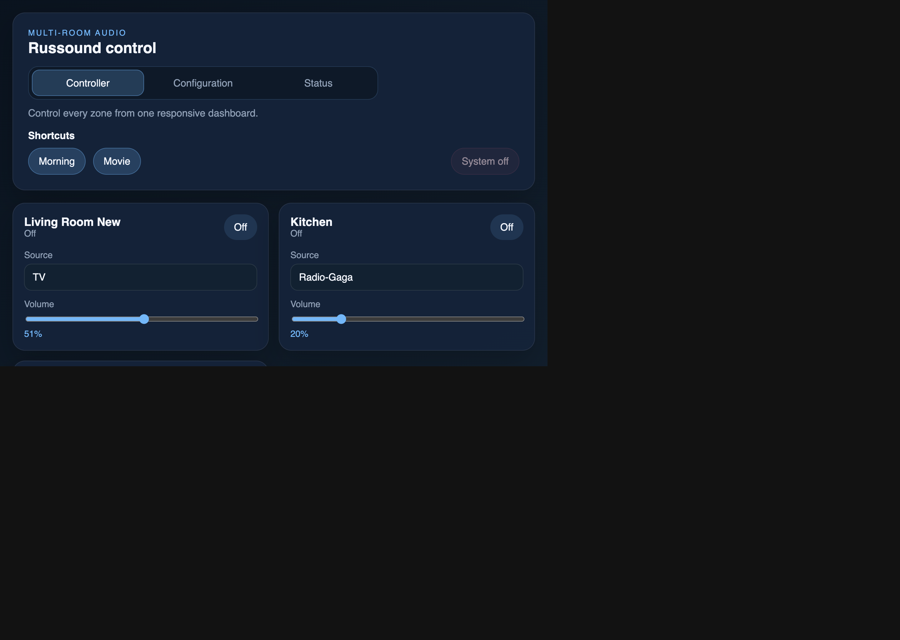
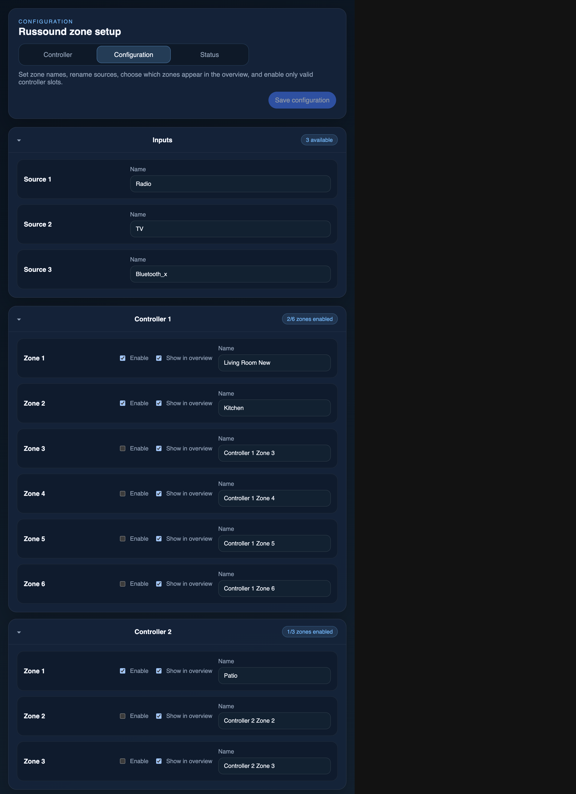
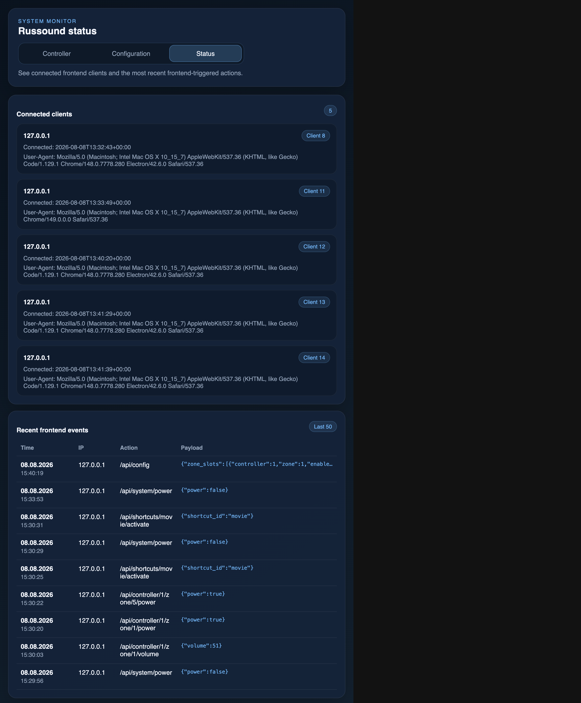

# MPDRussoundPi

MPDRussoundPi is a Python-based control stack for Russound multi-room audio systems. It combines service setup automation, runtime control scripts, and a browser UI for day-to-day operation.

The repository currently includes:

- Russound + MPD setup automation for target hosts (Ansible playbooks).
- Runtime scripts for audio setup and MPD orchestration.
- A Flask-based, token-protected web control server with live synchronization.
- A controller dashboard with flip-card advanced sound controls and a visible hardware warning banner.
- A configuration editor for zones and sources.
- A status monitor for connected clients and recent frontend actions.

## UI Demonstration

### Controller Dashboard



### Configuration Editor



### Status Monitor



## Key Features

- Multi-zone Russound control (power, source, volume).
- Physical zone addressing via controller/zone mapping.
- Advanced sound controls for bass, treble, balance, and loudness.
- A prominent hardware connectivity warning banner when the backend cannot reach Russound hardware.
- Global system power-off action.
- Shortcut presets targeting multiple zones.
- Config-driven UI visibility and naming.
- Source renaming support in the web configuration editor.
- Live UI updates using Server-Sent Events (SSE).
- API request token enforcement for `/api/*` endpoints.

## Repository Structure

- `web/`: Python web server, controller logic, JSON config/state, and frontend assets.
- `tests/`: unit tests for controller logic, backend abstraction, server routing, and zone model.
- `ansible/`: provisioning and setup playbooks/tasks for deployment targets.
- `mpdrussoundpi/`: legacy/runtime Russound and MPD setup/control scripts.
- `AI_USAGE_DISCLAIMER.md`: policy statement on AI-assisted development.

## Architecture Overview

### Backend

- `web/russound_server.py`
  - Flask HTTP server.
  - Serves UI pages and static assets.
  - Exposes `/api/*` endpoints and `/api/events` SSE stream.
  - Enforces API token authentication.
- `web/russound_controller.py`
  - Domain/state orchestration.
  - Config loading and persistence.
  - Zone and shortcut mutation logic.
  - View payload building for frontend.
- `web/russound_backend.py`
  - Russound hardware adapter/wrapper.
  - Reads zone state and applies power/source/volume commands.

### Frontend

- `web/static/index.html` + `web/static/app.js`
  - Main control dashboard with the flip-card advanced audio controls and backend warning banner.
- `web/static/config.html` + `web/static/config.js`
  - Configuration editor for zones and input names.
- `web/static/status.html` + `web/static/status.js`
  - Runtime status page for clients/events.
- `web/static/styles.css`
  - Shared visual styling across all pages.

## Requirements

- macOS/Linux environment.
- Python 3.11+ recommended.
- Virtual environment support (`venv`).
- Access to Russound gateway/network where applicable.

## Quick Start (Local Development)

1. Clone the repository.
2. Create and activate a virtual environment.
3. Install dependencies.
4. Start the web server.

Example:

```bash
git clone <your-fork-or-origin-url>
cd MPDRussoundPi
python3 -m venv .venv
source .venv/bin/activate
pip install russound flask
python web/russound_server.py --config web/russound_config.json --state web/russound_state.json --port 8000
```

Then open:

- `http://127.0.0.1:8000/` (Controller)
- `http://127.0.0.1:8000/config` (Configuration)
- `http://127.0.0.1:8000/status` (Status)

## Configuration

The web server expects a JSON config file (for example `web/russound_config.json`).

Primary sections:

- `controllers`: hardware controllers with `id` and `zone_count`.
- `zones` (optional): user-facing zone definitions with `name`, `controller`, `zone`, and optional `visible`.
- `inputs`: available source list with numeric `id` and display `name`.
- `shortcuts` (optional): preset actions with `id`, `name`, `zone_addresses`, and optional `source`.

In `web/config_example.json`, `zones` and `shortcuts` are included as examples and can be omitted when not needed.

Use `web/config_example.json` as the base template for new environments.

## API Summary

The complete API reference is documented in `web/API.md`.

Common endpoints:

- `GET /api/state`
- `GET /api/config`
- `GET /api/status`
- `GET /api/events` (SSE)
- `POST /api/system/power`
- `POST /api/source`
- `POST /api/shortcuts/{shortcutId}/activate`
- `POST /api/controller/{controllerId}/zone/{zoneNumber}/power`
- `POST /api/controller/{controllerId}/zone/{zoneNumber}/source`
- `POST /api/controller/{controllerId}/zone/{zoneNumber}/volume`
- `POST /api/controller/{controllerId}/zone/{zoneNumber}/bass`
- `POST /api/controller/{controllerId}/zone/{zoneNumber}/treble`
- `POST /api/controller/{controllerId}/zone/{zoneNumber}/loudness`
- `POST /api/controller/{controllerId}/zone/{zoneNumber}/balance`

## Testing

Run the test suite with:

```bash
python -m unittest -q
```

Or run focused modules:

```bash
python -m unittest tests.test_zone tests.test_russound_backend tests.test_russound_controller tests.test_russound_server -q
```

## Deployment Notes

- API access is token-protected, but this is a same-origin request token model, not full user authentication.
- For non-local deployments, place the service behind a TLS-terminating reverse proxy.
- Restrict network access to trusted clients.

## AI-Assisted Development Disclosure

This repository includes AI-assisted contributions. See `AI_USAGE_DISCLAIMER.md` for details.

## License

See `LICENSE`.
